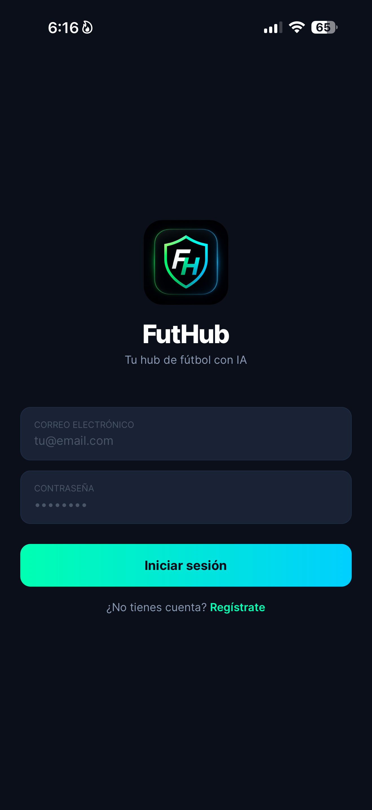
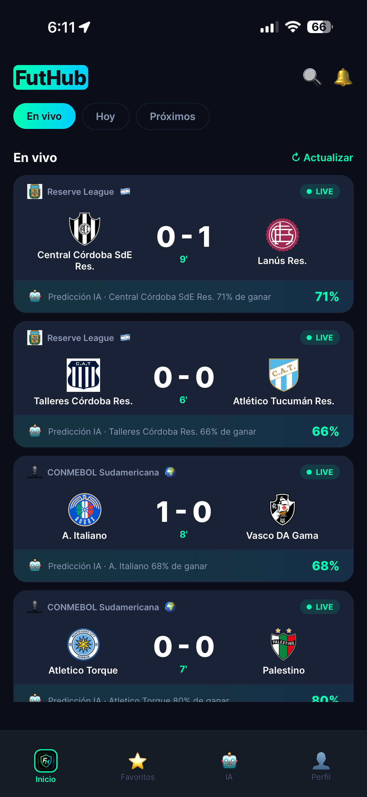
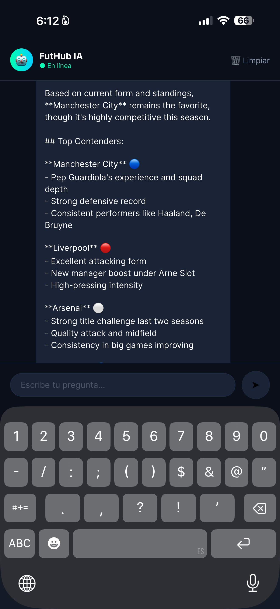

# FutHub ⚽

> **Live. Analyze. Win.** — Your AI-powered football hub

FutHub is a mobile football app with a built-in AI assistant, built with React Native and Expo. Soon Available for iOS and Android.

---

## 📱 Screenshots

<p align="center">
  
  
  
  
</p>

---

## ✨ Features

- ⚽ **Live Matches** — Real-time results from 1,000+ leagues worldwide
- 🤖 **AI Assistant** — Chat with a football-specialized AI (powered by Claude)
- 🏆 **Top Leagues** — Champions League, Premier League, La Liga, Bundesliga, Serie A, Liga BetPlay
- 🔍 **Search** — Find teams and leagues instantly
- 🌎 **Bilingual** — English and Spanish with automatic detection
- 🔐 **Authentication** — Login and register with Firebase
- 📊 **Match Stats** — Detailed statistics for every match
- 🎯 **AI Predictions** — Win probability powered by AI for every match

---

## 🛠 Tech Stack

| Technology | Usage |
|---|---|
| React Native + Expo | Mobile framework |
| Firebase Auth | Authentication |
| Firestore | Database |
| API-Football | Real-time match data |
| Claude Haiku (Anthropic) | AI Assistant |
| i18next | Internationalization |
| React Navigation | Navigation |

---

## 🚀 Getting Started

```bash
# Clone the repository
git clone https://github.com/jeanvq/FutHub.git
cd FutHub/FutHub

# Install dependencies
npm install --legacy-peer-deps

# Create environment variables file
cp .env.example .env
# Add your API keys to the .env file

# Run the app
npx expo start --tunnel
```

---

## 🔑 Environment Variables

Create a `.env` file with the following keys:

```env
EXPO_PUBLIC_ANTHROPIC_KEY=your_anthropic_api_key
EXPO_PUBLIC_FOOTBALL_KEY=your_api_football_key
```

---

## 📁 Project Structure

```text
FutHub/
├── src/
│   ├── api/
│   │   └── football.js          # API-Football integration
│   ├── config/
│   │   └── firebase.js          # Firebase configuration
│   ├── navigation/
│   │   ├── TabNavigator.js      # Main navigation
│   │   └── AuthNavigator.js     # Auth navigation
│   ├── screens/
│   │   ├── auth/
│   │   │   ├── LoginScreen.js
│   │   │   └── RegisterScreen.js
│   │   ├── HomeScreen.js        # Live matches
│   │   ├── MatchDetailScreen.js # Match detail
│   │   ├── IAScreen.js          # AI Assistant
│   │   ├── FavoritosScreen.js   # Favorite teams
│   │   └── PerfilScreen.js      # User profile
│   └── theme/
│       ├── index.js             # Colors and typography
│       ├── i18n.js              # i18n configuration
│       ├── es.js                # Spanish translations
│       └── en.js                # English translations
├── assets/
│   └── futhub-icon.png
├── App.js
└── app.json
```

---

## 🎨 Design

- **Color Palette:** `#00FFB2` · `#00CFFF` · `#007BFF` · `#0B0F1A`
- **Typography:** Inter (Regular, SemiBold, Bold, ExtraBold)
- **Theme:** Native dark mode

---

## 👨‍💻 Author

**Jeancarlo** — Web Development Student @ TriOS College  
[LinkedIn](https://www.linkedin.com/in/jeancarlo-ricardo-392b4a365/) · [Portfolio](https://jeancarlodev.com) · [GitHub](https://github.com/jeanvq)

---

## 📄 License
